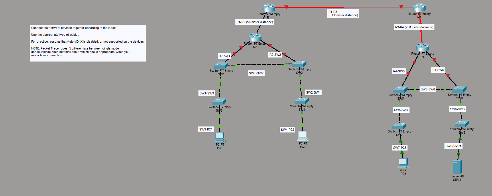

### Visual Layout

  

##Day 2 - Interfaces and Cables

## What problem does this solve?

Network devices require appropriate interfaces and cable types to communicate.

Understanding cable selection is essential for building and troubleshooting networks.

## Topics Covered

- Ethernet interfaces
- Copper cables
- Fiber optic cables
- Console connections
- Auto-MDIX

## Labs Included
# Day 2 Lab - Connecting Devices

## Objective
Connect all devices using the appropriate cable type while assuming Auto-MDIX is disabled.

## Devices Used

- Routers
- Switches
- PCs
- Server

## Concepts Practiced

- Copper straight-through cable
- Copper crossover cable
- Fiber optic cable
- Single-mode vs Multi-mode fiber selection

## Cable Selection Logic

Different devices:
- PC ↔ Switch
- Switch ↔ Router
Use:
- Straight-through

Similar devices:
- Router ↔ Router
- Switch ↔ Switch
Use:
- Crossover

Long distances:
- Fiber optic cable

## Key Learning

Auto-MDIX makes cable selection automatic on modern devices, but understanding manual cable selection is still important for CCNA fundamentals.

## Files Included

- Handwritten notes
- Packet Tracer topology
